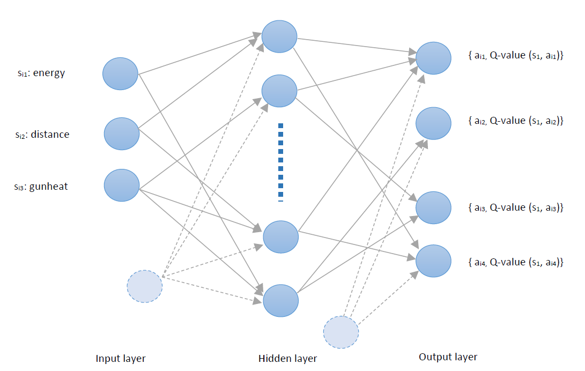
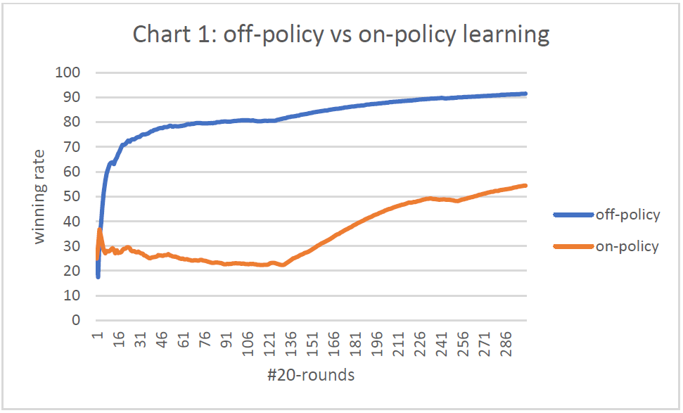
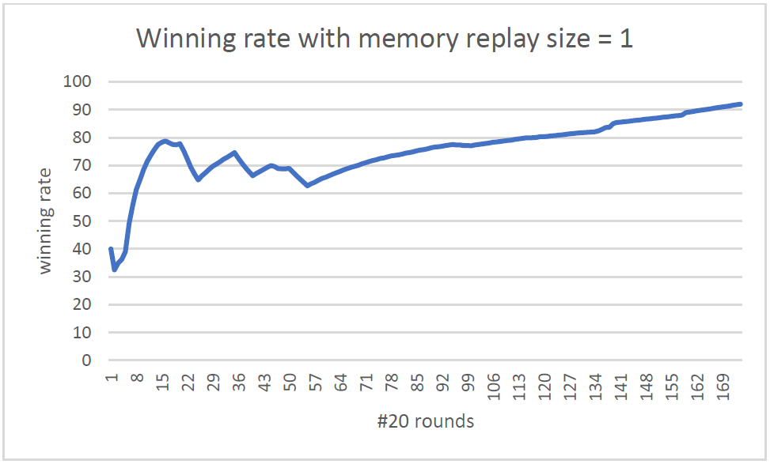
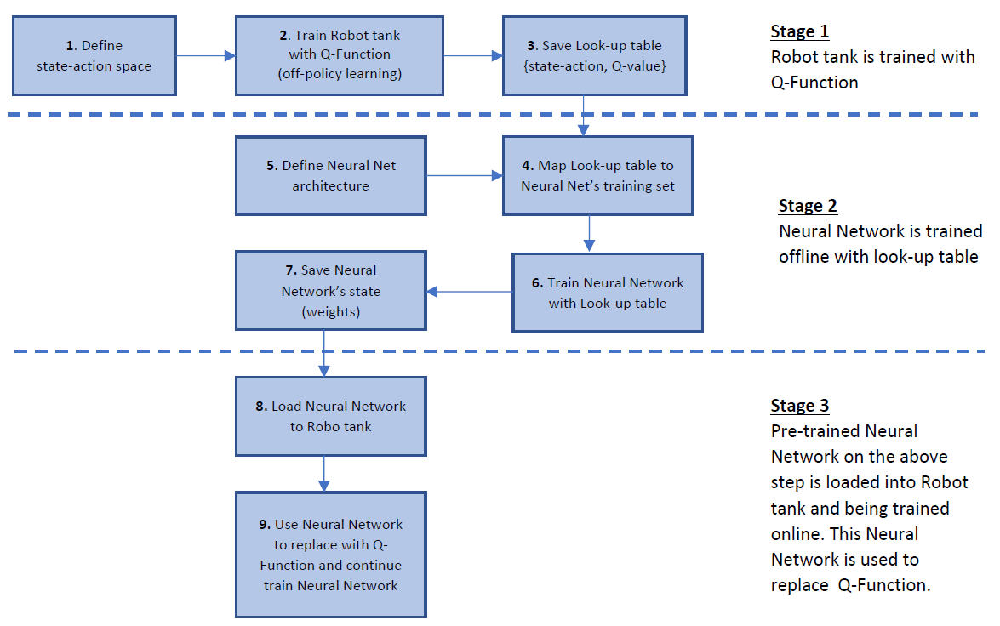
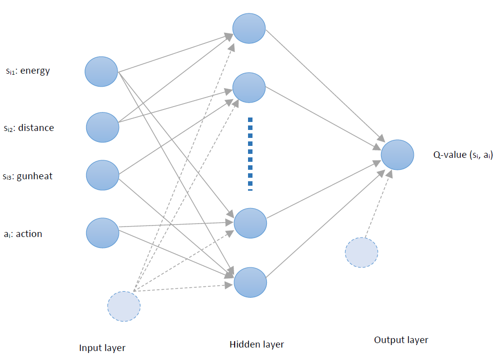
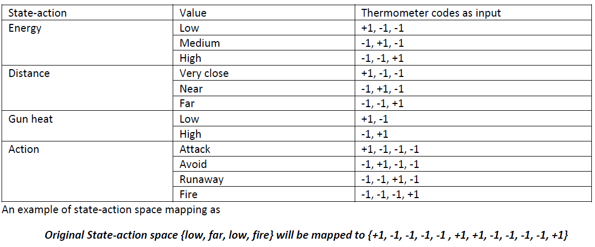
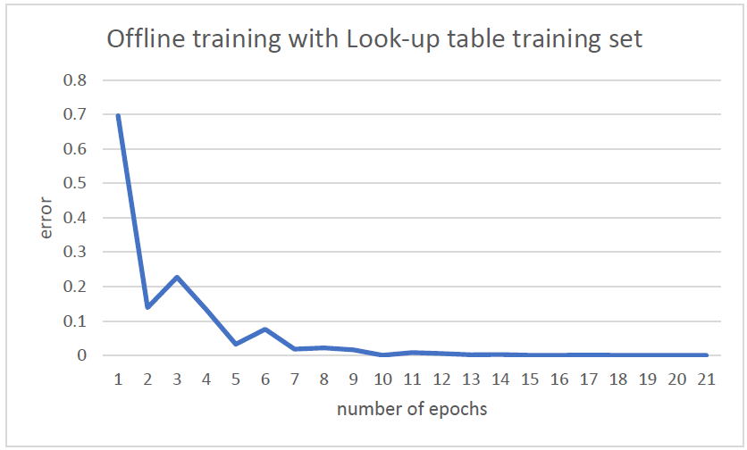
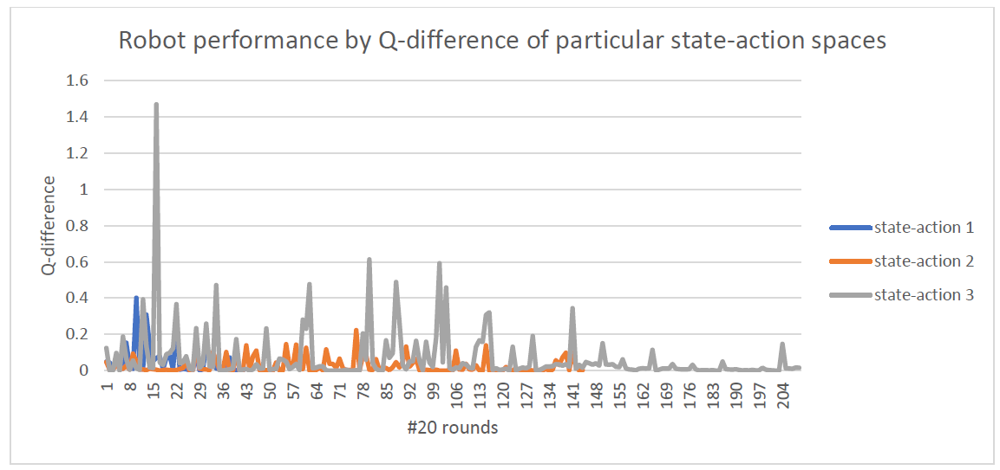

# An Experiment of Deep Q-Learning with Robocode
This project aims to perform different experiments to have a better practical understanding about the Reinforcement Learning (RL) using Q-Learning and using Function Approximation with Backpropagation Neural Network.
The implementation has two primary parts: a backpropagation neural network, and a reinforcement learning to build a tank on Robocode platform.

**Part 1: backpropagation neural network**

The neural network has been trained by backpropagation algorithm with different activation function options. 
The implemented neural network has multiple inputs, one hidden layers with multiple neurons, and multiple outputs as shown on image blow.
Both hidden and output layer have bias with variant weights on each bias.

*Testing*

It has been fully unit tested using XOR and BIPOLAR XOR presentation. The XorNeuralNetRunner is written for experimenting different hyper-parameters manually.

*Implementation*

The implementation is on "src\main\java\backpropagation", and more details is written on my article about ["backpropagation algorithm"](https://phuongle.github.io/2021/01/backpropagation-neural-net.html).

**Part 2: Reinforcement Learning to build a robot tank**

*Testing*

This robot tank has been tested against enemy Tracker, 

The performance of using Q-Learning is as on the image below.

   

The winning rate shows the different performance between on-policy and off-policy algorithm.

The performance of using Q-Function Approximation is as on the image below.

   

The winning rate can reach above 90% after around 3000 rounds.

*Implementation and Design*

The implementation can be found at "src\main\java\reinforcement". The overall design is on the next section.

##Implementation Objectives

This project has following learning objectives. Most of them were implemented, and tested.

**Neural Network** 

+ [How to train a neural network by using Backpropagation algorithm?](https://phuongle.github.io/2021/01/backpropagation-neural-net.html)
- How to measure a neural network's performance?
- Bias and Weights

**Reinforcement Learning**

- How to implement Reinforcement Learning with Q-Learning algorithm to build a Robot tank in Robocode platform?
- How to implement on-policy vs off-policy algorithm (aka Q-Learning vs SARSA)?, and why off-policy is more preferable than on-policy algorithm?
- How to measure a Reinforcement Learning performance?
- How to implement Q-Function Approximation using Backpropagation Neural Network?
- How to implement State-Action space less reduction in Q-Function Approximation?
- How to implement Memory Replay in Deep Q-Network training?

##Implement Q-Function Approximation using Backpropagation Neural Network

###Approach
This project is to inspect a popular Q-function approximation method which is Deep Q-Network using Neural Networks to estimate Q-values. The approach is shown on the image below

   

### Reinforcement Formulation
As Reinforcement Learning is an algorithm to specify the appropriate Action of a specific States by learning from a Reward system,
it is important to identify following artifacts
- States
- Actions
- Reward

**State**

The state is captured by 3 sub-states
State 1: the robot’s energy. It has 3 levels: low, medium and high
State 2: the distance from robot to the enemy. It has 3 levels: veryClose, near and far
State 3: the robot’s gun heat. It has 2 levels: low, high

**Action**

There are 4 following actions: Attack, Avoid, Runaway, Fire

**Reward**

- Bad terminal reward: reward - 10 if the robot is killed by the enemy.
- Good terminal reward: reward + 10 if the enemy is killed by the robot.
- Bad instant reward: reward -3 if the robot is hit by the enemy or wall.
- Good instant reward: reward + 3 if the robot hit the enemy.

**Enemy**

This Robot tank is trained and tested against the enemy Tracker.

With the above formulation and using Q-Learning algorithm, the robot has performed in 6000 rounds to save the latest (also the best) Lookup table to use for offline training step

### Offline training
Using this architecture, the neural network used to implement Q-Function approximation can also have inputs as state-action space vector and single output as the corresponding Q-Value as illustrated on the image below

   

**Input normalization**
As all the state-action space values are continuous variables, the easiest way is to use “Thermometer” codes to present it. Using the same state-action space size, the mapping will look like image blow

   

**Output normalization**
The Q-value will also be normalized in range [-1,1] to feed into target output of the neural network. This can be done by scale the min/max Q-values to fall between [-1, 1]. Additionally, since there are few state-action spaces that are not visited, these Q-values will be over normal range which should be considered as null data. Those values will be eliminated out of the training data set.

**Neural network training with backpropagation algorithm**
After having a set of inputs vectors and expected outputs, the neural network has been trained using backpropagation algorithm, and the best result is saved to be used for online-training step
- Number of Inputs: 12 (3 for Energy, 3 of Distance, 2 for GunHeat, and 4 for Action).
- Number of Hidden Neurons: 12 
- Learning Rate: 0.1
- Momentum: 0.9
- Activation function: bipolar sigmoid

   

###Online training
Using the pre-trained neural network, the robot has continued online training with Experiment Replay technique. The result of the neural network is shown as image below

   

